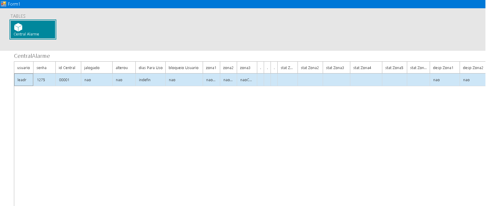
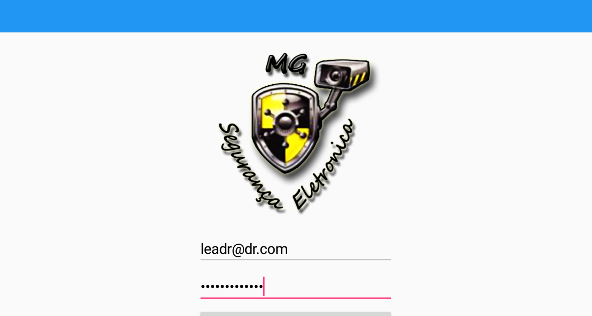
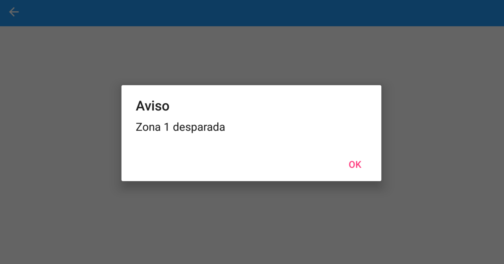

<h1 align="center">Central-Alarme</h1>
<h4 align="center">Projeto em desenvolvimento, uma central de alarme utilizando arduino</h4>

<h3 align="center">Para controle da central:</h3>
 
<ul>
  <li>Software de cadastro desenvolvimento em C#, para cadastrar editar novas centrais</li>
  <li>App android desenvolvimento em Xamarin, para cadastrar, editar zonas de disparos e para notificações de disparos</li>
  <li>Um webservice desenvolvimento em C#, para comunicação entre App, Software e Arduino</li>
</ul>
 
<h4 align="center">Tela do software de cadastro:</h4>

<h4 align="center">Tela de login do Aplicativo:</h4>

<h4 align="center">Tela do aplicativo ao receber um disparo em alguma zona:</h4>

